# ECE1508RL - Using RL for Traffic Signal Control

# 1. Introduction
The problem of traffic congestion has been a major challenge for many cities in modern days. It results in longer travel time, more fuel consumption, and more CO2 emissions. In major cities, intersections signalized by traffic lights often cause long queues and high waiting times as a result of inefficient traffic light schedules, especially in dynamic and unpredictable traffic conditions. Traditional control strategies are usually static and unable to adapt to the real-time situation of the traffic, causing non-optimal performance when the traffic volumes change during the day.

Reinforcement Learning (RL) provides a data-driven framework to develop adaptive traffic signal control systems that learn and evolve optimal signal policies through interactions with the varying environment. By formulating signal control algorithm as a sequential decision-making problem, the RL agent can use current traffic conditions to predict future congestions, then choose signal strategies that minimize waiting time and reduce congestions. Compared to static signal systems, RL has the potential to handle the traffic conditions dynamically and more effectively.

This project uses Deep Reinforcement Learning to solve the traffic signal control system problem with a lightweight simulation environment. The goal is to demonstrate how RL can help improve the traffic management performance while indicating the trade-offs between model complexity, generalization, and applicability in real world.

# 2. Baseline & RL Models

## 2.1 Baseline Models
### 2.1.1 Fixed-Timing
We first estimate the traffic flow and predefined each traffic light duration time. Each current phrase (traffic light) will change to the next current phrase at a constant time. The transfer of the current phrase repeats in a cycle, regardless how the environment has changed.

### 2.1.2 Round-Robin
We implement a simple round-robin controller as a non-adaptive baseline. The intersection alternates between the East–West and North–South phases in a fixed cyclic order, assigning equal green durations to each phase. This ensures fairness between the two directions but does not respond to varying traffic densities.

## 2.2 RL Models
### 2.2.1 Deep-Q Network (DQN)
DQN is a popular off-policy reinforcement learning algorithm which estimates the action-value function (q(s,a)) by neural network and chooses subsequent actions that maximize the return. DQN has two core mechanisms - experience replay, which breaks the potential correlation between samplings by random selection, and target network, which utilizes two different neural networks to prevent overfitting and gradual parameter updates.The architecture of Double DQN and Dueling head will ensure algorithm stability as well. This algorithm is ideal for our traffic signal control problem due to its nature of effectiveness for discrete action choice problems. 

### 2.2.2 Proximal Policy Optimization (PPO)
PPO is a popular on-policy reinforcement learning algorithm which optimizes the policy by gradient estimates of value function. PPO has a core mechanism of clipping, which limits the step size in policy iteration. By constraining the policy change ratio in each update, PPO ensures steady policy improvement. In addition, Generalized Advantage Estimation (GAE) will also be implemented to calculate the reward. This algorithm is ideal for our traffic signal control problem due to its capability of hybrid/ continuous control and stable delivery of learning curve.

# 3. Usage Example
### 3.1.1 Baseline - Fixed-Timing

For fixed-timing simulation, run `self_designed_env/simulation.py`.   You can switch between ideal/realistic environment by choosing simulation function in `run_simulation()`.

### 3.1.2 Baseline - Round-Robin

For round-robin simulation, run  `PPO/round_robin.py`

### 3.2.1 RL Models - DQN
For DQN simulation, run `DQN/train.py`.   You can switch between ideal/realistic environment by choosing simulation function in `train()`.   You may also choose different reward function in `TrafficEngine_realistic._compute_reward()` in `DQN/traffic_env.py`
### 3.2.2 RL Models - PPO
For PPO simulation, run `PPO/train.py`.   You can modify the training environment by editing `PPO/config.py`.   You can also tune the hyperparameter by editing `PPOagent()`'s input variables inside the `train.py` file at line 37. 
 
  You might evaluation the tarined model by playing it within the environment again by using `evaluation.py`. 
  Before doing that, please save the `.pth` file and enter its path at line 10 within `evaluation.py`.

# 4. Sample Output
### 4.1.1 Baseline - Fixed-Timing
#### Ideal Environment

 

#### Realistic Environment

### 4.1.2 Baseline - Round-Robin
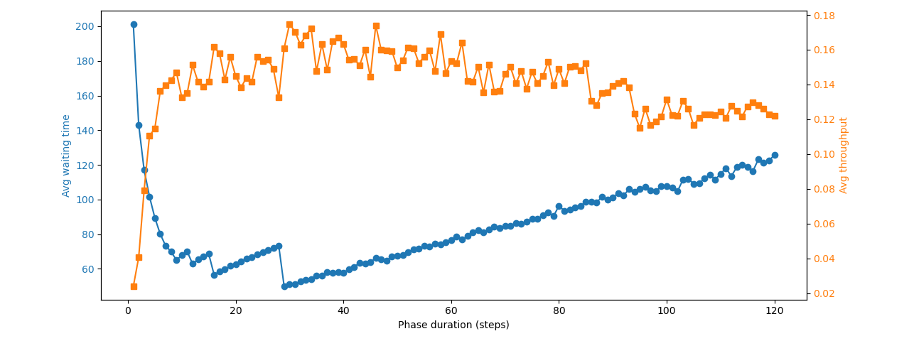
 

### 4.2.1 RL Models - DQN
#### Ideal Environment

 

#### Realistic Environment

##### Reward Function A

##### Reward Function B

##### Reward Function C

##### Reward Function D

### 4.2.2 RL Models - PPO
#### Reward Function E - stable result
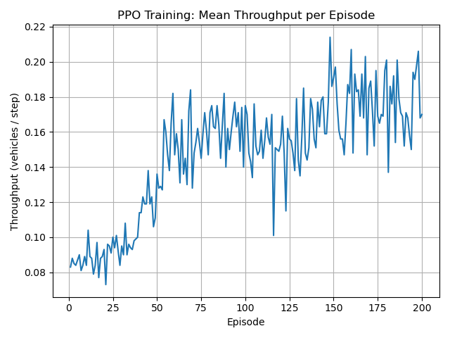
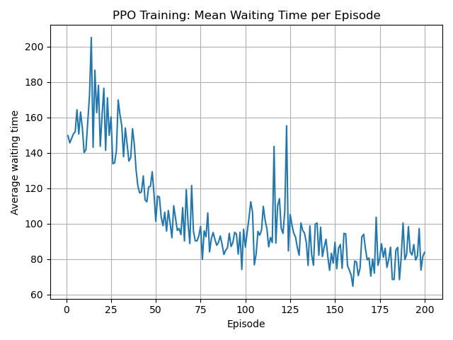
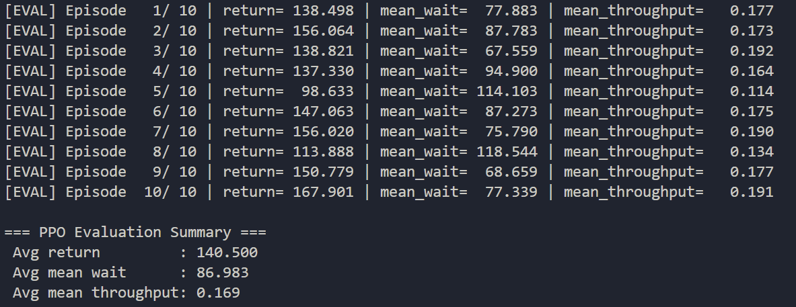

#### Reward Function F - delay(heavy waiting time penalty)-oriented result
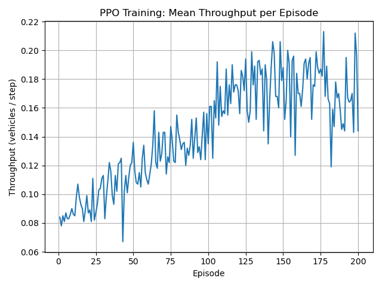
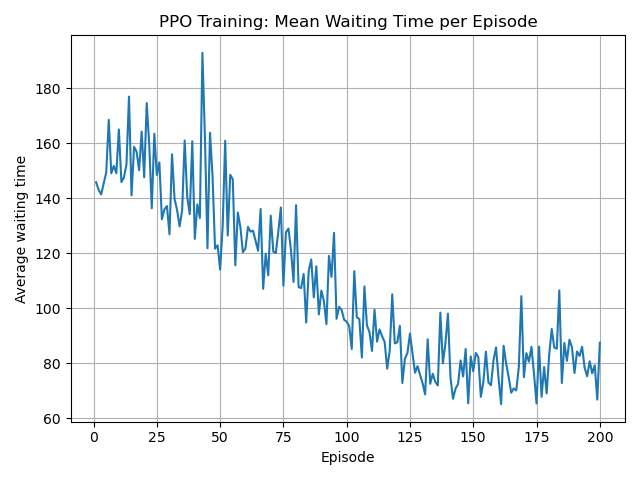
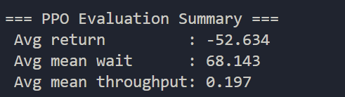

#### Reward Function G - default(heavy queue length penalty)-oriented result
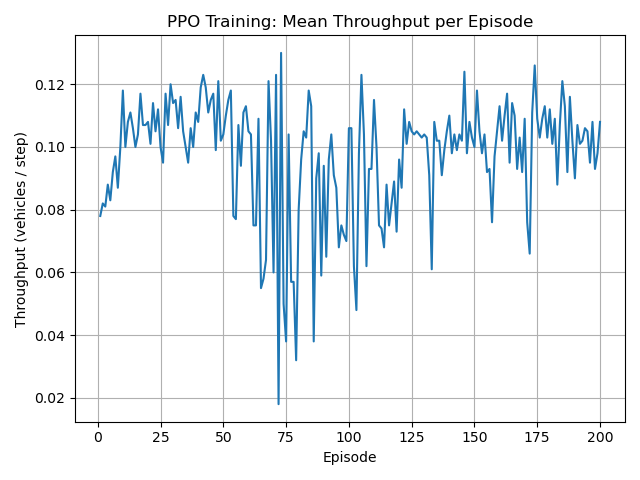
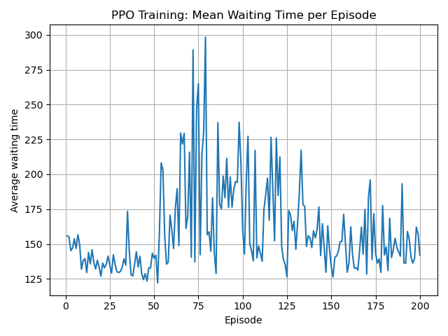
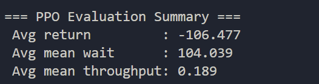

#### Reward Function G (failed example) - imbalanced queue length penalty result
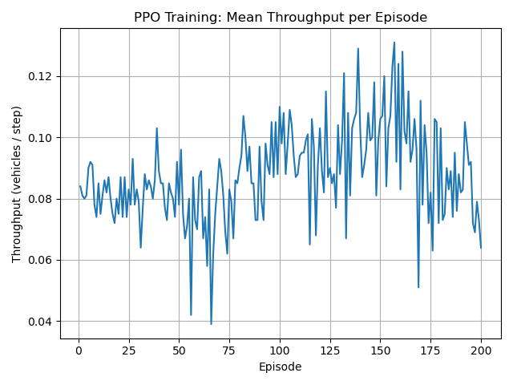
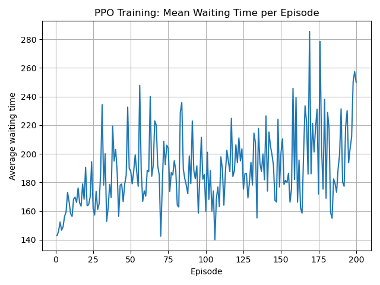
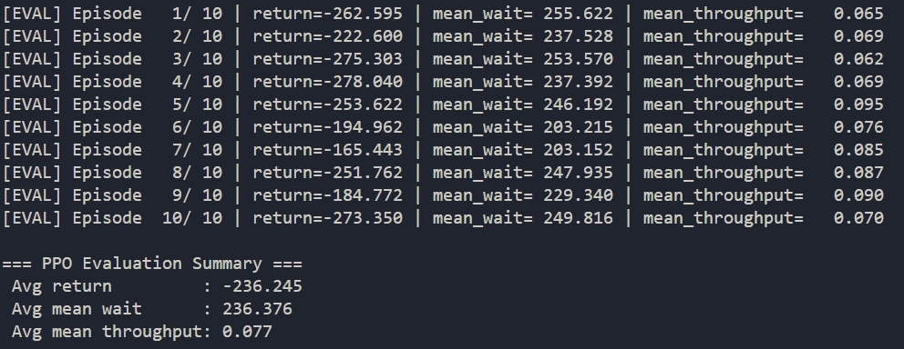

#### PPO different reward shaping comparsion
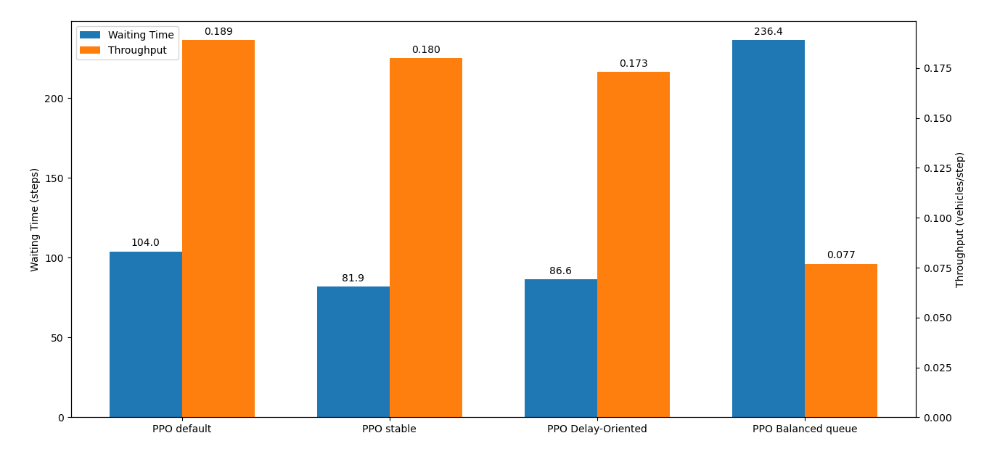
